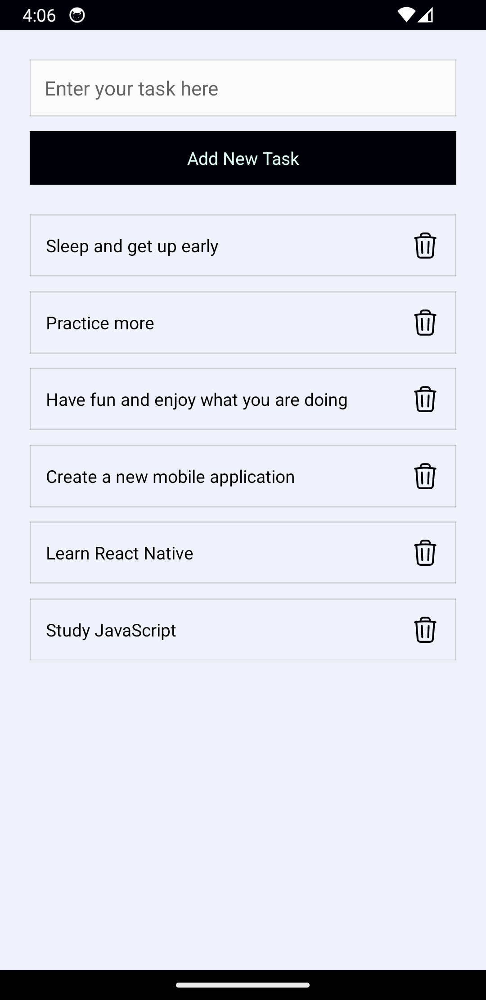

# Simple Todo List with React Native and Expo

https://expo.dev/accounts/ahmed0saber/projects/todo-list/builds/fcfa1910-2e00-4c55-8c32-64254fe725aa

# Screenshots

screenshot for the application running on android emulator

## Resources

https://reactnative.dev/docs/environment-setup?guide=quickstart

https://docs.expo.dev/build/setup/#a-react-native-android-andor-ios-project

https://docs.expo.dev/build-reference/apk/

